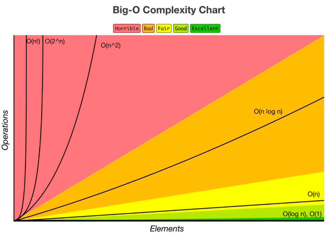

# Big O Notation
## O que é?
Dado tempo suficiente, todo desenvolvedor encontrará uma solução para um problema. O que importa é o quão bem o problema foi resolvido. Como diferenciar um código ok de um bom código? Diferenciar um bom código de um excelente código?

É nisso que o Big O nos ajuda, ele pode nos dizer o quão bem um problema foi resolvido.

Mas antes, vamos falar do que é um bom código

## Mas afinal, o que é um bom código?
Podemos descrever um bom código tem essas duas características:
- Legível
  - Outros conseguem ler e entender seu código com facilidade?
  - O código está bem organizado, identado e com nomenclaturas fáceis de entender?
- Escalável
 - É isso que o Big O nos ajuda a mensurar.

 Se pensarmos no clássico do algoritmo e pensar numa receita de bolo, certamente é possível entender que existem meios eficientes de se fazer um bolo e jeitos completamente ineficientes de se fazer um bolo (podemos até pensar em assar a massa do bolo com fósforos xD). E é utilizando o Big O que conseguiremos entender se a solução foi eficiente ou não.

Vamos olhar para um cenário bem simples

 ```
import (
	"fmt"
	"log"
	"math/rand"
	"time"
)

func main() {
	rand.Seed(time.Now().Unix())
	listaAleatoria := rand.Perm(10)

	percorrerLista(listaAleatoria)
}

func percorrerLista(array []int) {
	inicio := time.Now()
	for i := 0; i < len(array); i++ {
		if array[i] > 0 {
			fmt.Println("Número é maior que zero!")
		}
	}
	tempo := time.Since(inicio)
	log.Printf("Percorrer a lista levou %s", tempo)
}
 ```

 Ao rodar o código com 10 números, o resultado foi de
 ```
 Percorrer a lista levou 1.0657ms
 ```

 Ao rodar com 100 números, o resultado já muda
 ```
 Percorrer a lista levou 9.5705ms
 ```

 Com 1000 números
 ```
 Percorrer a lista levou 137.6928ms
 ```

 Claro que esses valores vão mudar de acordo com as especificações do computador que estiver rodando, tal como os programas que estiverem rodando e mais alguns fatores que podem influenciar, mas percebe que quanto maior a quantidade de números, mais tempo vai levando?

 Nosso ponto aqui ainda é código escalável, se eu aumento a minha quantidade e o tempo aumenta, ele é escalável? 

 Podemos medir a eficiência com Big O desconsiderando as diferenças de ambiente, colocando os resultados numa escala. E a escala do Big O é essa aqui: 
 
 

 Pode ficar um pouco confuso no início, mas vamos falando disso aos poucos e vai fazer bastante sentido.

 Mas usando o nosso exemplo do código acima, o que esse gráfico mostra é: Quando nosso número de elementos aumenta, quantas operações a mais vamos precisar? O quanto o nosso algoritmo desacelera? Isso é chamado de eficiência algoritmica.