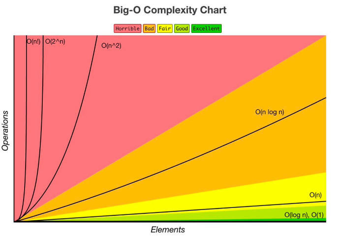
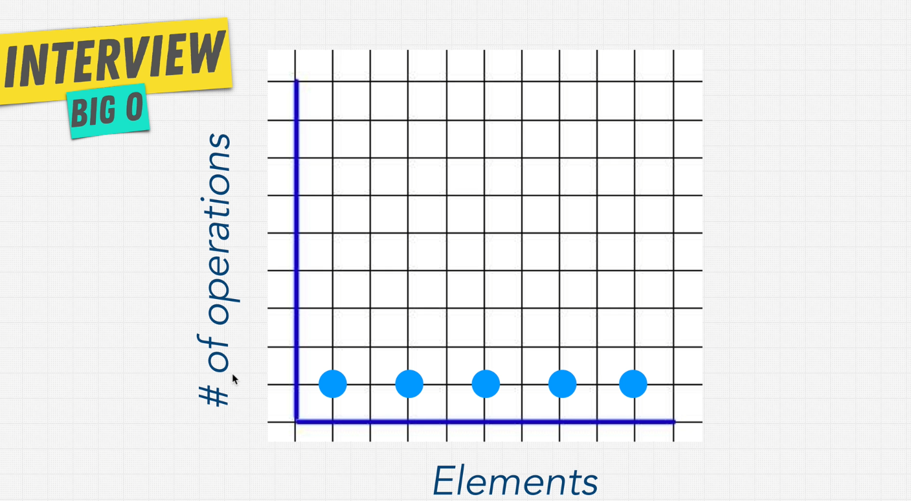

# Big O Notation
## O que é?
Dado tempo suficiente, todo desenvolvedor encontrará uma solução para um problema. O que importa é o quão bem o problema foi resolvido. Como diferenciar um código ok de um bom código? Diferenciar um bom código de um excelente código?

É nisso que o Big O nos ajuda, ele pode nos dizer o quão bem um problema foi resolvido.

Mas antes, vamos falar do que é um bom código

## Mas afinal, o que é um bom código?
Podemos descrever um bom código tem essas duas características:
- Legível
  - Outros conseguem ler e entender seu código com facilidade?
  - O código está bem organizado, identado e com nomenclaturas fáceis de entender?
- Escalável
	- É isso que o Big O nos ajuda a mensurar.

 Se pensarmos no clássico do algoritmo e pensar numa receita de bolo, certamente é possível entender que existem meios eficientes de se fazer um bolo e jeitos completamente ineficientes de se fazer um bolo (podemos até pensar em assar a massa do bolo com fósforos xD). E é utilizando o Big O que conseguiremos entender se a solução foi eficiente ou não.

Vamos olhar para um cenário bem simples

 ```
import (
	"fmt"
	"log"
	"math/rand"
	"time"
)

func main() {
	rand.Seed(time.Now().Unix())
	listaAleatoria := rand.Perm(10)

	percorrerLista(listaAleatoria)
}

func percorrerLista(array []int) {
	inicio := time.Now()
	for i := 0; i < len(array); i++ {
		if array[i] > 0 {
			fmt.Println("Número é maior que zero!")
		}
	}
	tempo := time.Since(inicio)
	log.Printf("Percorrer a lista levou %s", tempo)
}
 ```

 Ao rodar o código com 10 números, o resultado foi de
 ```
 Percorrer a lista levou 1.0657ms
 ```

 Ao rodar com 100 números, o resultado já muda
 ```
 Percorrer a lista levou 9.5705ms
 ```

 Com 1000 números
 ```
 Percorrer a lista levou 137.6928ms
 ```

 Claro que esses valores vão mudar de acordo com as especificações do computador que estiver rodando, tal como os programas que estiverem rodando e mais alguns fatores que podem influenciar. E não se apegue muito ao tempo de execução por enquanto, isso foi apenas para ilustrar. O que vai importar mesmo é o número de operações dado uma determinada entrada de dados.

 Nosso ponto aqui ainda é código escalável, se eu aumento a minha entrada, o número de operações aumenta.

 Podemos medir a eficiência com Big O desconsiderando as diferenças de ambiente, colocando os resultados numa escala. E a escala do Big O é essa aqui: 
 
 

 Pode ficar um pouco confuso no início, mas vamos falando disso aos poucos e vai fazer bastante sentido.

 Mas usando o nosso exemplo do código acima, o que esse gráfico mostra é: Quando nosso número de elementos aumenta, quando a nossa entrada aumenta, quantas operações a mais vamos precisar? O quanto o nosso algoritmo desacelera? Isso é chamado de eficiência algoritmica.

 ## Falando de notações
 ### O(n)
 Essa é a notação do nosso algoritmo. O(n) significa que o tempo é linear, ou seja, para uma entrada, haverá uma operação, duas entradas, duas operações e assim sucessivamente. O "n" da notação se refere ao número de elementos na entrada. No nosso exemplo, se traduziria para: O(10), O(100) e O(1000) respectivamente aos testes anteriores.

 ### O(1)
 É entendido como uma constante. Pensando no nosso exemplo dos números, se fossemos calcular apenas o primeiro item de um array, sem considerar os outros, o tamanho do array não importaria, o tempo seria uma constante.
 Vamos ver na prática:

 ```
 func calculaPrimeiroNumero(array []int) {
	inicio := time.Now()
	if array[0] > 0 {
		fmt.Println("Número é maior que 0!")
	}
	tempo := time.Since(inicio)
	log.Printf("Calcular o primeiro número levou %s", tempo)
}
 ```

Se rodarmos essa função passando os 1000 itens:
```
 Calcular o primeiro número levou 504.7µs
```

Se rodarmos essa função passando os 100000 itens:
```
 Calcular o primeiro número levou 0s
```

Opa, houve um aumento! de microssegundos para algo em torno de 0 segundos. Isso ainda é muito pouco significativo quando comparamos com os resultados anteriores do O(n), onde o aumento foi bastante expressivo. Sem contar que esse aumento pode acontecer simplesmente pelo volume de dados que está sendo passado para a função calcular. O tempo de execução sempre será constante, dado a necessidade de apenas uma única operação, independente do volume da entrada.

> Apenas ressaltando que apesar de estarmos olhando pro tempo de execução, o que o Big O notation mede são as operações necessárias dada uma entrada.



No exemplo acima, podemos ver que, conforme o número de elementos aumenta, o número de operações não aumenta, por isso o tempo é constante.


## Mas como calcular?
Até agora, falamos de duas notações de big o, mas não abordamos ainda o tópico de como calcularmos por nós mesmos essas notações. Existem algumas "regras" que podemos aplicar para facilitar a nossa vida na hora de mensurar uma função.

### O pior cenário
Quando calculamos Big O, nós **sempre** estamos olhando para o pior cenário.
Vamos modificar um pouco o nosso exemplo para melhor ilustrar esse conceito.

```
func main() {
	lutadores := []string{"ryu", "ken", "chunli", "blanka", "sagat", "bison", "vega", "balrog", "dhalsin", "akuma"}
	encontraRyu(lutadores)
}

func encontraRyu(lutadores []string) {
	for _, lutador := range lutadores {
		if lutador == "ryu" {
			fmt.Println("Encontrei o ryu!")
			break
		}
	}
}
```

Nesse exemplo, temos 10 lutadores, e se rodarmos a função do jeito que ela está, a função precisará rodar apenas uma vez, porque o ryu está na primeira posição e com auxilio da palavra `break` nós sairemos do loop quando encontrarmos o ryu.
Mas se o ryu estivesse mais ou menos pela metade, veja abaixo:
```
func main() {
	lutadores := []string{"ken", "chunli", "blanka", "sagat", "bison", "ryu", "vega", "balrog", "dhalsin", "akuma"}
	encontraRyu(lutadores)
}

func encontraRyu(lutadores []string) {
	for _, lutador := range lutadores {
		fmt.Println("Tentando encontrar o ryu") //inserindo um log para ilustrar
		if lutador == "ryu" {
			fmt.Println("Encontrei o ryu!")
			break
		}
	}
}
```

O resultado já seria diferente:
```
Tentando encontrar o ryu
Tentando encontrar o ryu
Tentando encontrar o ryu
Tentando encontrar o ryu
Tentando encontrar o ryu
Tentando encontrar o ryu
Encontrei o ryu!
```

E se ele estivesse na última posição?
```
func main() {
	lutadores := []string{"ken", "chunli", "blanka", "sagat", "bison", "vega", "balrog", "dhalsin", "akuma", "ryu"}
	encontraRyu(lutadores)
}

func encontraRyu(lutadores []string) {
	for _, lutador := range lutadores {
		fmt.Println("Tentando encontrar o ryu") //inserindo um log para ilustrar
		if lutador == "ryu" {
			fmt.Println("Encontrei o ryu!")
			break
		}
	}
}
```

O resultado seria assim:
```
Tentando encontrar o ryu
Tentando encontrar o ryu
Tentando encontrar o ryu
Tentando encontrar o ryu
Tentando encontrar o ryu
Tentando encontrar o ryu
Tentando encontrar o ryu
Tentando encontrar o ryu
Tentando encontrar o ryu
Tentando encontrar o ryu
Encontrei o ryu!
```

Note que a nossa função precisou percorrer as 10 posições do array para encontrar o ryu. Como nosso array só tem 10 posições, entendemos que esse é o nosso pior cenário. Se o ryu estivesse na primeira posição, esse é o nosso melhor cenário. Mas, o que importa para o Big O é o pior cenário. Por isso, essa solução é O(n), porque se o elemento que queremos estiver na última posição, teremos que percorrer todo o array até encontrá-lo.

### Ignorar as constantes
Quando estamos tentando calcular Big O, podemos abordar de uma maneira mais linha a linha e somarmos todos os resultados. Se abordássemos dessa forma, teríamos algo parecido com isso:

```
func percorrerLista(array []int) {
	inicio := time.Now() // O(1) por ser apenas uma atribuição
	for i := 0; i < len(array); i++ { // O(n) porque vai acontecer n vezes a partir de uma chamada da função
		if array[i] > 0 { // O(n)
			fmt.Println("Número é maior que zero!") // O(n)
		}
	}
	tempo := time.Since(inicio)                     // O(1)
	log.Printf("Percorrer a lista levou %s", tempo) // O(1)
}
```
Poderíamos calcular, então, a complexidade dessa forma:

`O(1 + n + n + n + 1 + 1)`

Que poderia ser simplificado para

`O(3 + 3n)`

Mas, lembra do gráfico que demonstra as notações? Não há nada parecido com isso lá. Podemos simplificar essa exibição e remover as constantes. Quais são as constantes? Esses números definidos que utilizamos. 

Sem as constantes, esse seria o resultado:

`O(n)`

Muito mais simples, não?

E tem uma outra questão também. Se n valer 10000, qual diferença adicionar + 3? ou + 50?

Se n valer 100.000.000, ainda que multiplicar por 3 possa adicionar um peso, no fim do dia, é n, porque vai depender da entrada.


### Termos diferentes para inputs diferentes

Essa regra pode parecer um pouco confusa no início, mas vamos direto para um exemplo:

Vamos pegar o mesmo código da regra anterior, e adicionar uma regrinha a mais.

```
func percorrerLista(array []int, array2 []int) {
	for i := 0; i < len(array); i++ { // O(n) porque vai acontecer n vezes a partir de uma chamada da função
		if array[i] > 0 { // O(n)
			fmt.Println("Número é maior que zero!") // O(n)
		}
	}

	
	for i := 0; i < len(array2); i++ { 	
			fmt.Println(array2[i]) 
	}
}
```
> A partir de agora não vamos mais nos atentar ao tempo, Big O mensura a escalabilidade, quanto mais nossa entrada cresce, o quanto nossa eficiência diminui ou permanece a mesma.

Repare que no código, agora, recebemos dois parâmetros diferentes. E apenas para título de demonstração, estamos percorrendo o segundo array e exibindo os valores dentro dele.

Ora, seguindo a lógica anterior, aqui ainda teremos um O(n), não?

Bem, não exatamente.

A regra diz "diferentes termos para diferentes inputs", o primeiro parâmetro e o segundo parâmetro são duas entradas diferentes. Nesse caso, representamos esse algoritmo dessa forma: `O(a + b)`.

> Desde o início, estamos usando "n" como um determinado valor ou conjunto de valores, mas "n" é um valor arbitrário, poderíamos escrever O(x), O(y), etc. 

Escrevemos dessa forma porque os valores de "a" e "b" podem ser diferentes, logo um "2n" não representaria corretamente o cenário.

Mas, e se os loops estivessem aninhados?
```
func logParesDoArray(array []int) {
	for i := 0; i < len(array); i++ {
		for j := 0; j < len(array); j++ {
			fmt.Printf("%d %d\n", array[i], array[j])
		}
	}
}
```

Repare que agora, o segundo for está dentro do primeiro. Qual será o Big O disso?
Nesses casos, ao invés de usar a adição para representar o Big O, usaremos a multiplicação. O Big O desse código seria então: `O(n^2)`. 

Se voltarmos ao nosso gráfico, podemos ver que essa notação é, na verdade, terrível. Olha em como a linha vai quase reta pra cima!
 

No exemplo anterior, do nosso `O(a + b)`, se os dois inputs estivessem aninhados, usaríamos `O(a * b)`. A regra de dedão é:
- Se está sequencial, um após o outro, é soma.
- Se está aninhado, um dentro do outro, multiplicamos.

### Ignorar as constantes não dominantes

Vamos considerar o seguinte código
```
func somarTodosOsPares(array []int) {
	fmt.Println("Esses são os números")
	for _, numero := range array {
		fmt.Println(numero)
	}

	fmt.Println("Essas são as somas dos pares")
	for _, primeiroNumero := range array {
		for _, segundoNumero := range array {
			fmt.Println(primeiroNumero + segundoNumero)
		}
	}
}
```

O que ele faz é apenas exibir os números que chegaram no input e somar todos os pares. Similar a um exemplo anterior, mas dessa vez, ao invés de exibir, estamos somando os pares.

Qual seria o Big O desse código?

Podemos pensar na soma dos elementos, temos um loop, depois temos mais um loop com outro loop dentro dele ou `O(n + n^2)`, certo?

Mas, a regra nos diz para ignorar as constantes não dominantes. Isso significa que vamos nos importar apenas com a parte mais importante, que é `n^2`. 

Por que ela é a parte dominante?

Falando muito rapidamente de matemática, vamos imaginar que n = 5, nosso Big O seria assim `O(5 + 5^2)`. 5^2 = 25, logo é a parte dominante. 

O Big O desse código, seria então, `O(n^2)`.

> Para cada loop aninhado, aumentamos o expoente. 3 loops aninhados seria n^3 e por ai vai. Mas esse comportamento é altamente desencorajado, porque se n^2 já escala mal, imagina coisas maiores
